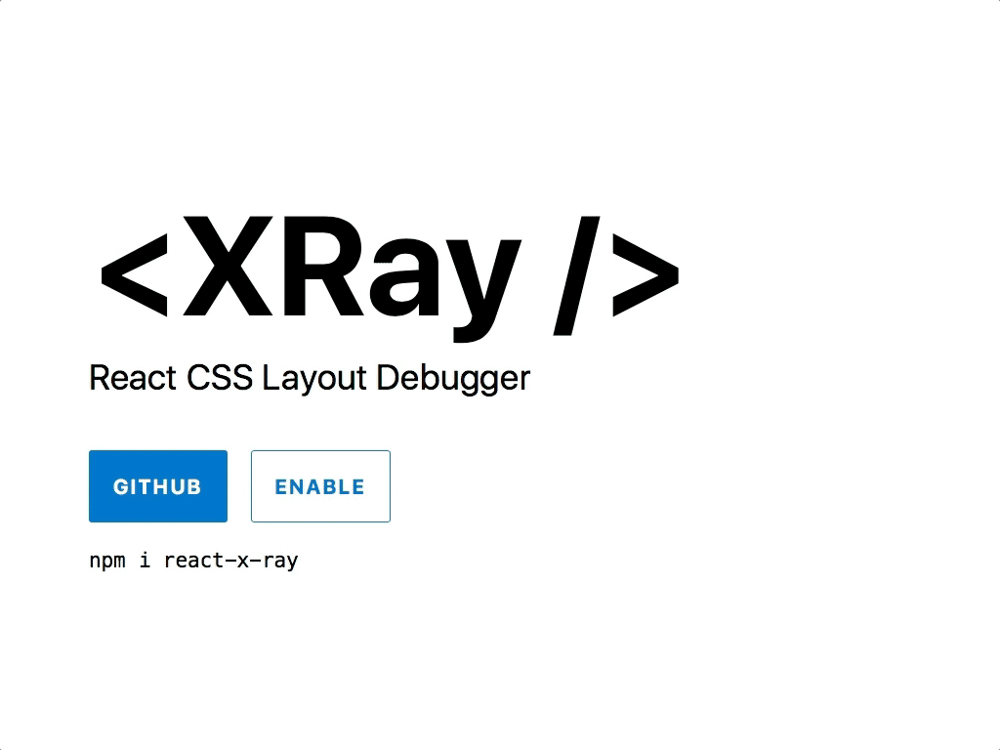

# React X-Ray

React CSS Layout Debugger



```sh
npm i react-x-ray
```

Demo: <http://jxnblk.com/react-x-ray>


## Usage

```jsx
import React from 'react'
import XRay from 'react-x-ray'

const App = props => (
  <XRay>
    <div style={{ padding: 32 }}>
      <h1>Look at me!</h1>
    </div>
  </XRay>
)
```

## Props

- `grid` (number or boolean) pixel dimensions of background grid
- `outline` (boolean) show element outlines
- `center` (boolean) center the background grid
- `color` (string) base color for grid and outlines
- `backgroundColor` (string) background color of XRay component

Inspired by [Tachyons X-RAY](http://tachyons.io/xray/)

MIT License
